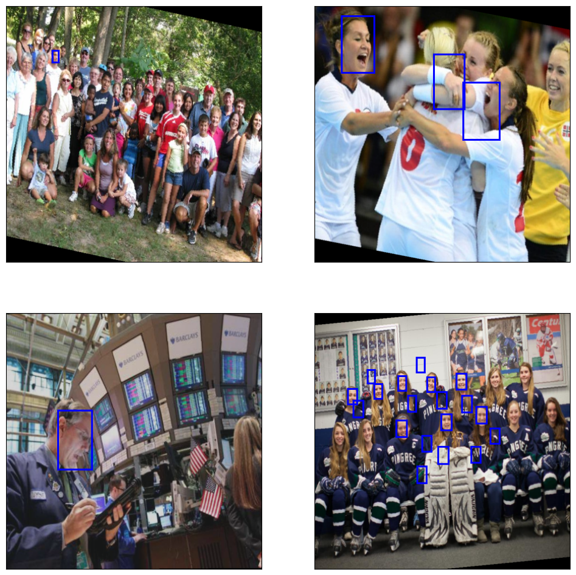

## Intro 
The notebooks folder contains different notebooks specifically for anchor calculation, training network on WiderFacedataset and for Channel pruning the Tiny_YOlov4.

- Refer to [anchor_caln](./Notebooks/Anchor_box_calculation_Wider_Face.ipynb`) for anchor calculations.
- Refer to [trainig_testing](YOLOv4-Tiny_Pytorch/Network_Training/Notebooks/TinyYolov4_on_wider_face_detection.ipynb) to train and test the model.
- Check [pruning]("./Notebooks/Channel Pruning Tiny YOLOv4 on Wider Face Dataset.ipynb") for magnitude based channel pruning of the TinyYOlov4.

## Sample Results

